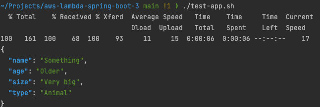
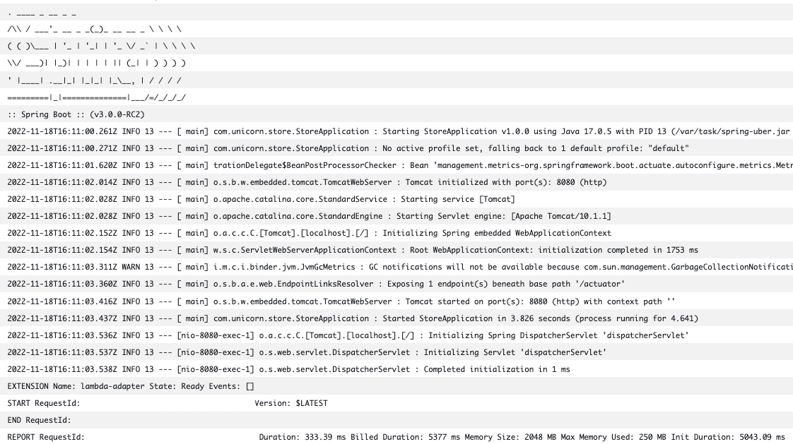

# Spring Boot 3 on AWS Lambda example

The following repository contains an example of a Spring Boot 3 application that is running on AWS Lambda (Java 17). It leverages the new version of the [Serverless Java Container library](https://github.com/awslabs/aws-serverless-java-container) for compatibility between API Gateway events and Spring Boot 3. For additional information please see this [hands on workshop](https://catalog.workshops.aws/java-on-aws-lambda/en-US/01-migration/01-setup-and-deploy/java-container).   

## Prerequisites

- Maven
- Java 17
- [AWS CDK CLI](https://docs.aws.amazon.com/cdk/v2/guide/cli.html)

## How to build, deploy & test the application

Ensure you are using Java 17 and build the application:

```
mvn clean package -f unicorn-store-spring/pom.xml
cp unicorn-store-spring/target/spring-boot-lambda.jar infrastructure/cdk/app
```

If you haven't used AWS CDK on your AWS account before run:

```
cdk bootstrap
```

Deploy the application via AWS CDK use:

```
./deploy.sh
```

After successful deployment you can use the following script to test the application:


```
./test-app.sh
```

## Result





